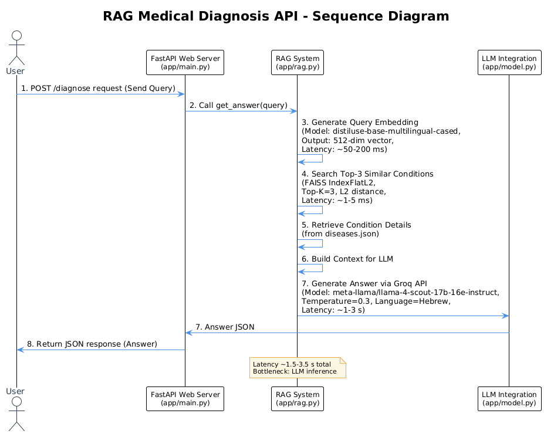
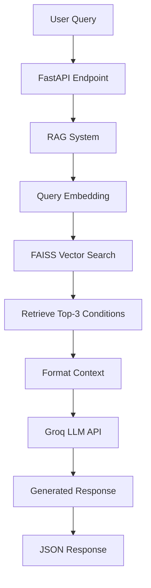

# RAG Medical Diagnosis API

Intelligent, Hebrew-language medical assistance powered by Retrieval‑Augmented Generation (RAG): FastAPI + Sentence Transformers + FAISS + Groq LLM.

---

## 📐 Architecture (UML & Sequence)

| Diagram                                         | Description                               |
| ----------------------------------------------- | ----------------------------------------- |
|          | High‑level component & data flow overview |
|  | Detailed request lifecycle across layers  |

**Core Flow (per request)**

```
User Query → FastAPI → (Lazy Init if first query) → Embed → FAISS Vector Search → Context Assembly → Groq LLM → Response
```

## 🔧 Main Components

| Layer          | File                                             | Responsibilities                                                         |
| -------------- | ------------------------------------------------ | ------------------------------------------------------------------------ |
| API            | `app/main.py`                                    | FastAPI app, routing, models, CORS, health & diagnosis endpoints         |
| RAG Core       | `app/rag.py`                                     | Lazy model/data/index load, embedding, FAISS similarity, prompt assembly |
| LLM Adapter    | `app/model.py`                                   | Groq Chat Completions call, error surface                                |
| Knowledge Base | `data/diseases.json`                             | Curated Hebrew medical conditions & metadata                             |
| Infra          | `Dockerfile`, `docker-compose.yml`, `nginx.conf` | Container build, orchestration, reverse proxy, rate limiting             |

### Notable Design Choices

- **Lazy Initialization**: Heavy model + index are loaded only on first query (reduces cold deploy memory spikes; see `RAG_LAZY_INIT`).
- **Deterministic Retrieval**: Always top‑K (configurable) exact L2 search (FAISS `IndexFlatL2`) for medical reliability (no approximate recall loss).
- **Separation of Concerns**: Prompt & retrieval independent of transport layer—simplifies testing and future migration to other model providers.
- **Debug Traceability**: Optional `debug=true` query parameter on `/diagnose` returns embedding & retrieval metadata (indices, distances, prompt excerpt).

## 🚀 Request Lifecycle (Performance Budget)

| Stage | Operation                                         | Typical Duration                           |
| ----- | ------------------------------------------------- | ------------------------------------------ |
| 1     | HTTP accept / validation                          | ~1 ms                                      |
| 2     | (First request only) Lazy init model + load FAISS | 8‑40 s (download + encode if index absent) |
| 3     | Embed query (512‑d)                               | 50‑200 ms                                  |
| 4     | FAISS top‑K search                                | 1‑5 ms                                     |
| 5     | Context JSON formatting                           | 1‑3 ms                                     |
| 6     | LLM generation (Groq)                             | 1‑3 s                                      |
| 7     | Serialize & respond                               | ~1 ms                                      |

> After first initialization, steady‑state end‑to‑end latency: **~1.5–3.5 s** (dominated by LLM call).

## ✅ RAG Advantages

- Grounded: Answers constrained to curated knowledge base
- Reduced Hallucination: Model cannot fabricate unseen conditions
- Semantic Robustness: Multilingual model handles phrasing variations
- Deterministic Retrieval: Exact vector search ensures recall consistency
- Extensible: Swap model / add ranking stage without changing API

## 🧪 Example (Hebrew Query)

Input: `"יש לי כאב ראש"`

Top‑3 retrieved (illustrative): `"כאבי ראש מתח"`, `"מיגרנה"`, `"כאב צוואר"`

Prompt excerpt:

```
שאלה: יש לי כאב ראש

מידע:
{ JSON blocks for the 3 matched conditions }
```

LLM synthesizes structured medical guidance in Hebrew referencing retrieved context only.

## 📁 Project Structure

```
MedialRAGModelServer/
├── app/
│   ├── main.py          # FastAPI app & endpoints
│   ├── rag.py           # Lazy RAG core (embedding + FAISS)
│   └── model.py         # Groq API adapter
├── data/diseases.json   # Knowledge base (Hebrew)
├── index/faiss.index    # Persisted FAISS index (generated)
├── docker-compose.yml   # API + optional nginx profile
├── nginx.conf           # Reverse proxy & rate limiting
├── Dockerfile           # Container build
├── requirements.txt     # Dependencies
├── .env.example         # Environment template
├── swagger.yaml         # OpenAPI schema
└── README.md
```

## 🛠️ Installation & Setup

### Prerequisites

- Python 3.8+
- Groq API key

### 1. Clone & Install

```bash
git clone <repo-url>
cd MedialRAGModelServer
python -m venv .venv && source .venv/bin/activate  # (Windows: .venv\Scripts\activate)
pip install -r requirements.txt
```

### 2. Environment Configuration

Edit the `.env` file with your configuration:

```env
# Required: Add your Groq API key
GROQ_API_KEY=your_groq_api_key_here

# Optional: Customize other settings
GROQ_MODEL=meta-llama/llama-4-scout-17b-16e-instruct
LLM_TEMPERATURE=0.3
VECTOR_SEARCH_TOP_K=3
PORT=8000
```

**Required Environment Variables:**

- `GROQ_API_KEY`: Your Groq API key (get one from https://groq.com)

**Optional Configuration:**

- `GROQ_MODEL`: LLM model to use
- `LLM_TEMPERATURE`: Response creativity (0.0-1.0)
- `VECTOR_SEARCH_TOP_K`: Number of conditions to retrieve
- `HOST`: Server host (default: 0.0.0.0)
- `PORT`: Server port (default: 8000)

### 3. Run (Development)

```bash
python app/main.py
```

Visit: http://localhost:8000 (Docs: /docs)

## ▶️ Docker Usage

| Scenario                      | Command                                     |
| ----------------------------- | ------------------------------------------- |
| API only (port 8000)          | `docker compose up -d`                      |
| API + nginx (8080 → API 8000) | `docker compose --profile production up -d` |

Health check:

```bash
curl http://localhost:8000/health
```

Diagnosis with debug:

```bash
curl -X POST http://localhost:8000/diagnose?debug=true \
  -H 'Content-Type: application/json' \
  -d '{"question": "יש לי כאב ראש"}'
```

## 📖 API Usage

### Endpoint: `POST /diagnose`

**Request:**

```json
{
  "question": "יש לי כאב ראש"
}
```

**Response:**

```json
{
  "question": "יש לי כאב ראש",
  "answer": "בהתבסס על המידע שסופק, כאב הראש שלך יכול להיות קשור למספר אפשרויות..."
}
```

### Interactive Documentation

- Swagger UI: `http://localhost:8000/docs`
- ReDoc: `http://localhost:8000/redoc`

## 🔍 Technical Details

### Vector Similarity Search

| Aspect            | Value                                            |
| ----------------- | ------------------------------------------------ |
| Embedder          | distiluse-base-multilingual-cased (multilingual) |
| Dimensionality    | 512                                              |
| Index Type        | FAISS IndexFlatL2 (exact)                        |
| Top‑K             | Configurable (`VECTOR_SEARCH_TOP_K`, default 3)  |
| Query Search Time | ~1–5 ms                                          |

### LLM Configuration

| Setting         | Value                                     |
| --------------- | ----------------------------------------- |
| Provider        | Groq API                                  |
| Model (default) | meta-llama/llama-4-scout-17b-16e-instruct |
| Temperature     | 0.3                                       |
| System Prompt   | Hebrew medical assistant                  |
| Latency         | 1–3 s typical                             |

### Performance Characteristics

| Metric                   | Cold (first request)                           | Warm             |
| ------------------------ | ---------------------------------------------- | ---------------- |
| Model + Index Load       | 8–40 s (if index build)                        | –                |
| Memory Peak (build)      | Depends on dataset (~ model + embedding array) | ~Model size only |
| Steady Memory (small KB) | ~<1 GB typical for chosen model                | same             |
| Query Latency            | 1.5–3.5 s                                      | 1.5–3.5 s        |
| Index Growth             | ~1 MB / 1k conditions (flat)                   | linear           |

> For constrained platforms set a smaller model via `EMBEDDER_MODEL` or pre‑commit the `faiss.index` to skip embedding construction.

### System Requirements (Guidelines)

| Environment | Minimum                    | Recommended               |
| ----------- | -------------------------- | ------------------------- |
| RAM         | 1–2 GB (lazy load)         | 4+ GB (faster cold start) |
| CPU         | 1 vCPU                     | 2+ vCPU                   |
| Storage     | 300–500 MB (model + index) | 1+ GB (growth)            |
| Network     | Stable outbound HTTPS      | Stable outbound HTTPS     |

## 🔄 Data Flow



## 🧪 Example Queries

| Hebrew Query    | Expected Response Type           |
| --------------- | -------------------------------- |
| "יש לי כאב ראש" | Headache-related conditions      |
| "חום וכאב גרון" | Fever and throat pain conditions |
| "כאב בטן"       | Abdominal pain conditions        |
| "קשיי נשימה"    | Respiratory issues               |

## ⚙️ Configuration

Environment variables (see `.env.example`):

| Variable            | Default                                   | Purpose                               |
| ------------------- | ----------------------------------------- | ------------------------------------- |
| GROQ_API_KEY        | (required)                                | Groq auth token                       |
| GROQ_MODEL          | meta-llama/llama-4-scout-17b-16e-instruct | LLM selection                         |
| LLM_TEMPERATURE     | 0.3                                       | Generation creativity                 |
| EMBEDDER_MODEL      | distiluse-base-multilingual-cased         | Sentence embedding model              |
| VECTOR_SEARCH_TOP_K | 3                                         | Retrieval depth                       |
| DATA_PATH           | data/diseases.json                        | Knowledge base path                   |
| INDEX_PATH          | index/faiss.index                         | Persisted FAISS index                 |
| RAG_LAZY_INIT       | true                                      | Defer heavy loading until first query |
| PORT                | 8000                                      | Service port                          |
| HOST                | 0.0.0.0                                   | Bind interface                        |
| LOG_LEVEL           | INFO                                      | Logging verbosity                     |
| MAX_QUERY_LENGTH    | 1000                                      | Input validation limit                |
| CORS_ORIGINS        | \*                                        | Allowed origins                       |

## 🛡️ Production Hardening Checklist

| Category         | Action                                                       |
| ---------------- | ------------------------------------------------------------ |
| Auth             | Add API key or JWT middleware                                |
| Rate Limiting    | Enforce at nginx & application (beyond included basic limit) |
| Observability    | Structured JSON logs, request IDs, metrics (Prometheus)      |
| Error Hygiene    | Sanitize internal exceptions before returning                |
| Index Versioning | Embed dataset hash & rebuild on mismatch                     |
| Scaling          | Run multiple Uvicorn workers or behind process manager       |
| Security         | HTTPS termination (enable TLS server block)                  |

## 🚀 Deployment Notes

| Target                   | Notes                                                                                                    |
| ------------------------ | -------------------------------------------------------------------------------------------------------- |
| Docker (single)          | Provided Dockerfile (can replace CMD with `uvicorn app.main:app --host 0.0.0.0 --port 8000 --workers 2`) |
| docker-compose           | `--profile production` adds nginx reverse proxy                                                          |
| Low‑Memory (Render free) | Rely on `RAG_LAZY_INIT=true`, pre‑generate index locally & commit to skip build                          |
| Fly.io / Cloud Run       | Use Docker image, mount volume or rebuild index at start                                                 |

## 🧪 Debug Mode

Add `?debug=true` to `/diagnose` to receive retrieval indices, distances & prompt preview (useful for evaluation; disable for public exposure).

## 🔍 Troubleshooting

| Symptom                         | Cause                               | Mitigation                                                                 |
| ------------------------------- | ----------------------------------- | -------------------------------------------------------------------------- |
| OOM during deploy               | Model + embeddings built eagerly    | Ensure `RAG_LAZY_INIT=true`; commit index; choose smaller `EMBEDDER_MODEL` |
| Slow first request              | Lazy cold initialization            | Warm up with a synthetic query after deploy                                |
| 404 behind proxy                | TLS block disabled but port exposed | Remove 443 mapping or enable HTTPS server block in `nginx.conf`            |
| Pydantic warning `schema_extra` | Pydantic v2 rename                  | Use `json_schema_extra` (already updated)                                  |
| Groq 401                        | Missing/invalid key                 | Set `GROQ_API_KEY` environment variable                                    |

## 📊 Monitoring Suggestions

Track: request latency histogram, FAISS search time, LLM API error rate, memory RSS, number of lazy init occurrences (should be 1), top query terms.

## 🧩 Development

| Task                       | Command                                    |
| -------------------------- | ------------------------------------------ |
| Run dev                    | `python app/main.py`                       |
| Rebuild index (delete old) | Remove `index/faiss.index` and run a query |
| Format (example)           | Add tool of choice (e.g. black)            |

## 🤝 Contributing

1. Fork & branch
2. Create feature / fix
3. Add / adjust tests (future enhancement) & docs
4. PR with clear rationale & change summary

## 📄 License & Compliance

Educational / research use. Ensure adherence to:

- Groq API Terms of Service
- Applicable medical information disclaimers
- Privacy & data protection regulations

---

**⚠️ Medical Disclaimer**: This system is NOT a substitute for professional medical diagnosis or treatment. Always consult a qualified healthcare professional for medical concerns.
